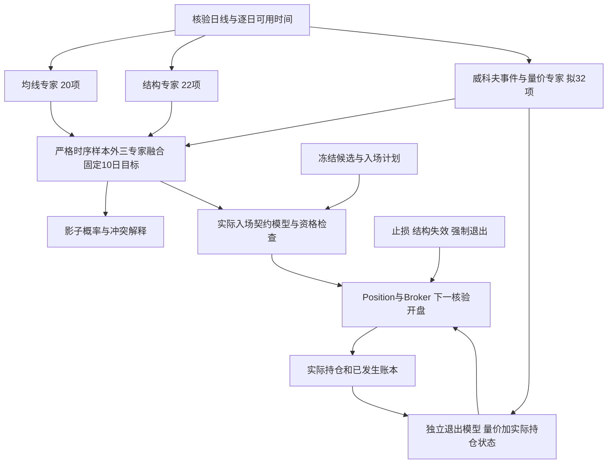

# Wyckoff 量价模型与结构均线融合研究计划

日期：2026-10-09。当前阶段：设计计划。首版采用逐日可确认的威科夫量价事件、独立量价 ML 专家、严格时序样本外三专家融合，并为真实持仓扩展独立退出模型。DL 作为后续受控对照。目标是改善完整费用后账本的收益和风险，同时研究买点与卖点的质量。

## 当前基线与研究目标

均线20项专家、结构22项专家及独立持仓退出头已经完成42个模型的训练。5572股扫描失败0，148项相关测试通过，全量独立审计0错误，三股跨五个检查点的连续账本与纯规则完全一致。数据截至2026-10-08，原始库有11,276,786条未复权日线；模型及实际成交研究范围为3197只沪深主板，其他板块保留覆盖与排除理由。[本阶段执行记录](../../knowledge_base/09_Decisions/20261009_Dual_Experts_Execution.md)

融合入场加退出的三个有交易开发窗口，完整费用后往返胜率为39.13%至43.18%，但每笔收益期望和账户净收益仍为负；2025Q2没有交易。退出更早也改变了期末已清仓样本的构成。下一阶段必须同时检查净收益、亏损幅度、未平仓、资金占用和回撤，不能用胜率替代盈利证据。

待检验的假设有三项：量价事件能否区分结构买点中的真实需求与失败突破；量价状态能否补充均线和结构已经包含的信息；真实持仓出现供应增强或弱势反抽时，提前退出能否改善费用后结果。三个假设分别通过入场、特征增量和退出消融检验。

## 威科夫事件与可用时间

威科夫方法通过价格、成交量和区间行为分析供需。首版研究 Spring 后的测试、SOS 后的 LPS，以及 Upthrust、SOW、LPSY 的卖方证据。吸筹与派发保持为带有不确定性的状态判断；日线量价不能证明某个机构的真实持仓或行为。[Wyckoff Analytics 方法说明](https://www.wyckoffanalytics.com/wyckoff-method/)

下表是本项目拟实现的因果事件定义。数值阈值属于工程假设，要在开发训练和验证段选择并冻结，不代表传统方法规定的统一参数。

|事件或状态|当日可核验的证据|研究用途|
|---|---|---|
|交易区间|此前已知的支撑、阻力、宽度、停留时间与反复测试|提供相对位置和失效边界|
|Spring 候选|价格探到此前支撑以下，随后已观测到收回区间|低位需求候选；等待后续测试时保持 pending|
|Spring Test|候选之后已发生回测，供给量和价差减弱且支撑保持|新入场质量证据|
|SOS|相对区间的上行进展、价差及相对成交量增强|突破质量证据|
|LPS|SOS 之后已经发生缩量回撤，并保持此前已知支撑|回撤入场候选|
|Upthrust 候选|突破此前阻力后，已经观测到回落区间|禁止新增或供应风险证据|
|SOW|向区间下沿的下行进展，结合价差和量能|真实持仓退出特征|
|LPSY|弱势之后已发生无力反抽，阻力未被收复|真实持仓退出特征|
|unknown 或冲突|区间不足、事件未确认或供需证据冲突|明确缺失或保留不确定性|

实现以日线顺序推进状态机，输出 `anchor_at`、`observed_at`、`available_at`、事件版本和区间边界来源。突破比较使用事件发生前已经形成的边界，不能把当天新高低纳入边界后再判断突破。形态可以在旧日期有锚点，但信号只能在确认日出现；后续测试不得修改以前保存的事件或概率。

首版从原始量价独立构造区间。另设实验比较已确认 CZSC 笔与中枢作为区间边界的效果，避免把结构专家的信息重复包装成独立证据。A至E阶段仅展示当前推断与已确认事件；首版不训练“最终阶段真值”分类器。人工校验只展示截至当时的图形，规则生成的弱标签不能直接被当作独立真值。

## 量价特征与数据要求

首版拟定义 `wyckoff_pv_v1` 的32项输入。均线和结构专家保留各自输入；量价专家先不接收它们的概率或价格均线，以便检验独立贡献。成交量均值仅用于量能归一化。

|特征组|数量|拟定输入|
|---|---:|---|
|单根价差|6|振幅相对ATR、实体相对ATR、收盘位置、上影比例、下影比例、开盘缺口相对ATR|
|量能与价格进展|8|20日相对量、60日稳健量能偏离、5日量相对20日量、20日相对成交额、上涨与下跌量比、量价进展差异、回撤与推进量比、缩量程度|
|区间与探测|8|区间宽度相对ATR、区间持续根数、收盘区间位置、距支撑、距阻力、短长窗口压缩比、向下探测深度、向上探测深度|
|已确认事件|10|Spring、Test、SOS、LPS、Upthrust、SOW、LPSY指示，事件年龄，需求证据分数，供应证据分数|

需求和供应分数先是可解释的规则分数，不称为获利概率。事件0表示当日确实未确认该事件；不可核验的输入保留缺失原因。相对量、分母截断、窗口、列顺序、单位及缺失处理写入 schema；不能用模型支持缺失值为理由绕过关键行情资格。

开发用20、60、120根历史上下文，序列模型也只使用截至信号日的后向窗口。日线为主，闭合周线作后续消融；周线必须按现有核验日历的实际闭合时间可用。相对指数强弱及行业特征待历史指数、行业成分和日期可用性核验后另立版本，不用当前成分回填历史。

数据工作先处理成交量和成交额单位、换源跳变、停牌、重复日期、零成交、极值、上市预热及公司行动断点。当前15股末端行情缺口保留不可用状态。价格形态研究需要识别除权除息，不能直接用后来下载的前复权全历史替换当时可见价格。优先补齐具备生效时间和来源的公司行动资料；研究坐标与 Broker 原始执行价分别绑定，现金分红和份额变化另经账本验证。无法处理的日期或证券显式排除并保留现金账户，不能静默删去困难样本。历史ST与退市覆盖未修复前，结果保留相应范围限制。

公司行动处理若改变价格坐标、费用后标签或Broker现金及份额，必须建立新数据、目标与profile版本，并在同一新版本上重训三位专家、融合器及独立退出头。对照臂也用同一新口径重训或重放；旧源报告只可并列诊断，不能作为新口径配对证据。不能把旧42模型的概率与不同目标的新量价概率直接拼接。旧模型和原始产物作为冻结记录保留，关键历史身份缺失阻断正式资格。

## 模型路线与三个目标

先完成事件规则和样本审查，再建立一个共享量价二分类专家。第一条 ML 基线是正则逻辑回归，复用现有 PyTorch；第二条是受限复杂度的梯度提升树，检验量价交互是否增加信息。当前环境未安装 scikit-learn、LightGBM 或 XGBoost。若采用 `HistGradientBoostingClassifier`，需先在隔离环境验证并锁定新增依赖，关闭随机内部验证和自动随机早停，使用显式时序验证段。[官方模型文档](https://scikit-learn.org/stable/modules/generated/sklearn.ensemble.HistGradientBoostingClassifier.html)

只有规则、样本和 ML 消融完成后才比较小型因果 TCN：输入最近60或120根量价序列，采用左侧填充和掩码，所有预处理只拟合训练段。TCN 是时序结构候选，论文中的通用序列结果不构成股票盈利证据。[TCN 原始研究](https://arxiv.org/abs/1803.01271)

首版冻结有限搜索预算，建议逻辑回归与树模型合计不超过6组配置，TCN至多2组且独立记录多重试验。早停、校准和阈值仅使用相应的时序验证段。训练与推理按实际CPU、MPS或CUDA记录；事件、结构及 Broker 仍在CPU，树模型不宣称GPU工作。

概率校准与交易阈值选择分别处理。决策阈值在相应固定候选池的时序验证Broker账本上选择，同时检查费用后收益、回撤、最低覆盖和完整往返数量，不再只按全部合格特征行的固定10日收益代理挑阈值。验证段无实际买候选、全部拒单或零交易时，结果为不可选择，不能当作优秀阈值；外层开发窗口和独立未来窗口不参与挑选。实际策略资格仍遵守下述目标契约。

|目标|输入与标签|能支持的结论|
|---|---|---|
|固定10日入场观察 `y10`|截至t收盘的量价；沿用现有t+1核验开盘买入、t+11核验开盘卖出，即持有10交易日的费用后正收益标签|与MA和结构专家保持同目标，可融合固定10日概率|
|真实持仓退出 `y_exit_v2`|Broker当日实际份额、现金、含费成本、持仓日数、冻结止损、已知量价；比较下一核验开盘退出与冻结续持规则的剩余份额费用后卖出结果|独立判断退出优劣；不由 `1-p_buy` 推导|
|实际交易入场 `y_policy`|冻结候选、入场计划及退出策略，用真实Broker逐笔生成的完整费用后往返；拒单和未成熟结果单独保留|为 fresh 或新增Wyckoff候选的实际退出契约建立购买资格|

`y10` 与实际持仓提前退出的收益目标不同，新的三专家10日模型仍不能自动取得实际交易资格。要应用到真实策略，需要 `y_policy` 匹配同一候选、入场、持仓和退出版本，并通过完整账本门槛。改变退出策略后必须重建其策略标签和契约。

`y_exit_v2` 先扩展现有独立线性退出头，加入量价状态和事件；再与受限树模型比较。训练状态来自冻结参考行为策略的真实持仓快照，保留行为策略身份、episode、份额、拒单及部分成交。续持路径只使用冻结规则或当时已可用的退出模型，不能让后来训练的退出头参与早期标签生成。两条路径都实际闭合后标签才成熟；未平仓保留删失状态，不强制期末虚拟成交。

现有退出头的持仓样本来自规则fresh，三专家或新候选会改变持仓分布。新策略状态用严格前向OOF模型和当时可用检查点的连续Broker回放生成，按入场政策报告覆盖与偏移，不能使用已看过该段标签的最终模型生成“理想持仓”。量价退出头与续持政策分别绑定版本；不支持的持仓状态保留影子或规则回退。

策略入场头在退出政策冻结后建立。训练、样本外及最终回放分别记录行为策略与状态覆盖，最终改进必须在新策略自己的完整连续账本中成立。若只能改善10日分类，而不能改善实际交易账本，则停留在分析影子层。

每个前向折先冻结其当时可用的退出政策，再对固定fresh全部满足可决策条件的候选生成策略入场标签，克隆各自截至当日的真实资金和风险状态进行Broker回放。样本不能只保留最终模型挑中的成交或盈利episode。拒单不当作亏损，未成熟或删失不当作负例；各类数量和原因单独报告。候选扩展使用另一个冻结候选版本重复同一流程。

## 三专家与买卖点融合

三专家分别输出同一 `y10` 的概率，融合器首先采用正则线性模型。其输入来自各专家严格前向的样本外预测；不能使用专家拟合训练样本得到的概率训练融合器。附加量价状态或交互项另作消融，不能默认提高复杂度。直接三个概率取平均或设置“全部超过门槛”只作为诊断对照；当前基线已有候选与概率阈值不相交的零交易窗口，需要显式检查覆盖。

默认第一轮保持原 fresh 候选池。Wyckoff只能解释或过滤已有买点，使对照能识别同一候选池的增量。第二轮单独研究 Spring Test 与 LPS 产生新候选：建立新的 `candidate_policy`、支撑失效价、下一开盘价格检查、风险仓位和冲突优先级。候选扩展有独立对照，不能把新增交易带来的收益混称为同池模型增益。

供需冲突先进入 WAIT 或降低影子置信度；是否否决新入场属于需要冻结并回测的规则。真实持仓退出独立评分，已有止损、结构失效和强制退出优先，模型不得否决。次日拒单、涨跌停、T+1、容量与部分成交继续由 Broker 处理。

按日自动选择同一目标、schema、数据来源和实际完成时间兼容的完整检查点。缺少Wyckoff模型或关键输入时返回明确不可用，普通路径回到原有规则与双专家影子，不能把缺失量价概率填0或用未来模型补齐。新包使用独立模型族及 manifest；旧dual包、活动别名、已有标签和账本不可变。Position和实际账本在检查点切换时连续，不能以换模型重新开仓。

## 时序评估与资格

开发只使用当前已知的2026-10-08及以前资料。四个已观察历史窗口继续作开发诊断；增加较长连续历史回放检查持仓、现金和检查点，不能把这些历史称为新独立验证。预处理只拟合训练段，校准与决策阈值按显式时序验证段冻结。所有标签按实际成熟日切分；固定10日目标和真实退出目标分别处理跨度和重叠，按episode及跨股共同日期管理依赖，不用随机股票行拆分。

既有dual的2026-10-12至2026-12-31协议保持原样。Wyckoff独立窗口从它自己的协议、代码、完整模型及配置实际冻结完成后的首个核验交易日开始，不能追溯为10月12日。实施期间被用于分析或调参的日期只作开发；不能用既有dual未来窗口的绩效选择Wyckoff的ML或DL赢家。

第一段前瞻影子用于工程和方向性观察。当前账本依赖区块为160及240交易日，季度长度不足以计算要求至少两个完整区块的配对区间；同时使用两者至少需要480个交易日，这只是技术下限。正式资格还需在启动前冻结功效、有效区块数、多重比较及延长观察规则。样本不足时保持不可用，不缩短区块或改为按股票独立抽样制造显著性。

### 冻结实验对照

所有对照使用同一数据版本、可交易池、费用、资金约束、日期和失败现金账户。C组保持原候选；E组研究候选扩展。

|组别|入场|退出|主要用途|
|---|---|---|---|
|C0|原组合规则|原规则|基础账本|
|C1|原双专家过滤|原规则|已有入场基线|
|C2|原双专家过滤|已有独立退出|主要完整系统基线|
|C3|量价规则过滤原候选，ML关闭|原规则|同池量价规则贡献|
|C4|仅量价ML过滤原候选|原规则|相对规则的ML贡献|
|C5|三专家10日融合过滤原候选|原规则|同目标入场增量|
|C6|原双专家过滤|加入量价的独立退出|退出增量|
|C7|三专家10日融合过滤原候选|加入量价的独立退出|组合与交互效果|
|C8|匹配实际退出契约的入场模型|同一冻结量价退出|实际契约闭环|
|E0|原候选与Wyckoff新候选合并，ML关闭|原规则|新增买点的规则基线|
|E1|同一合并候选，匹配策略契约的ML|同一冻结量价退出|候选扩展后的完整系统|

既有仅均线、仅结构、规则入场加既有退出三臂也保留，使原六臂全部可追溯；总计14组。首轮先执行事件与同池入场对照，持仓退出和候选扩展按阶段加入。表中“原”和“已有”指冻结的架构与政策；若数据或目标换版，模型需成为同口径新基线。完全同一来源和契约的旧开发账本可以经哈希核验引用，新增日期需按冻结规则重放。

历史主报告记录费用后账户净收益、每日收益、最大回撤、盈亏比、完整往返期望、胜率、尾部亏损、交易数、未平仓、拒单、持仓时长、换手、暴露及资金使用。不同退出政策用每日净值与完整episode一起比较，不能只配对各自已经闭合的交易。固定股票账户汇总明确为独立资金，若另建共享现金组合则单独立契约。

预注册的盈利资格至少要求：完整费用后净收益为正；相对C0、C2及规则加既有退出基线的主要收益增量在足够独立样本和多重比较校正后成立；最大回撤不高于冻结比较基线且满足既有风险预算；费用及滑点1.5倍和2倍压力下结果不因成本变为失败。开发阶段建议每窗至少50笔完整往返、合计至少200笔作为基本可解释性门槛，具体阈值须在研究启动前冻结；达到这些交易数也不替代日期区块和功效要求。零交易、样本不足、未平仓占比高及少数证券贡献过大的结果分别标明。

训练准确率、AUC、Brier和校准误差用于诊断，不能晋升策略。若只在一个窗口或一个事件有效，保留局部研究结果，不能改写全局资格。三专家固定10日头、实际入场头和退出头分别判断资格；发布必须绑定完整契约、实际训练完成时间及独立账本审计。

## 工程接入与网页展示

拟新增模块放在 `app/my_strategy/services/`，具体文件名在实现时按职责确认。

|模块|拟定职责|现有接入位置|
|---|---|---|
|`czsc_wyckoff_events.py`|逐日区间、事件确认、状态及时间谱系|只读原始OHLCV与已确认结构|
|`czsc_wyckoff_features.py`|32项量价profile、资格、缓存与schema|[研究特征profile](../../services/czsc_research_profiles.py)|
|`czsc_wyckoff_models.py`|独立量价专家、校准、三专家包和前向OOF|[现有双专家实现参考](../../services/czsc_dual_models.py)|
|`czsc_wyckoff_research.py`|实验臂、策略标签和独立RunContext|[现有研究驱动参考](../../services/czsc_dual_research.py)|
|退出profile扩展|实际持仓新特征、独立退出契约和导出绑定|[持仓退出](../../services/czsc_dual_exit.py)与[Broker](../../services/czsc_backtest.py)|
|共享入口与新模型族|分析、扫描、回测统一路由和回退|[共享运行层](../../services/czsc_research_runtime.py)、CLI、API及任务|

网页新增威科夫事件、区间、量价证据和第三专家输入面板，展示候选锚点、确认时间、失效价、模型目标及资格。原均线、结构、量价与融合的10日概率同口径比较；实际入场契约概率另列，真实持仓退出概率仅在实际Broker上下文中展示。图中区分事件候选、理论Position和真实成交，点选可查看条件与拒单理由。规则分数、模型概率和单个特征解释分别标注，不能把相关性解释成市场因果或机构买卖证据。

普通网页、扫描和回测初期仍为影子；模型应用只在显式离线对照臂。模型不可用时继续规则研究。日志显示每个专家及退出头的真实推理行数、批次、模型加载、缓存、CPU/MPS/CUDA和各阶段耗时；事件检测本身不计为神经网络GPU推理。

## 执行顺序与交付门槛

|阶段|交付|进入下一阶段的条件|
|---|---|---|
|P0 数据与协议|质量报告、事件与三个标签契约、候选/退出政策、实验和搜索预算|明确公司行动、来源、覆盖、可用日期及独立窗口；不把数据缺口隐藏在模型中|
|P1 事件和图形|逐日前缀一致的事件状态机、32项输入、盲看截至当日图形的样本审查|未来追加不改变旧事件与特征；可用时间、未知状态和重复事件测试通过|
|P2 量价ML与三专家|正则逻辑回归、可选树对照、严格前向OOF、同候选消融|100股完整流程及真实输入一致性通过，再做5572覆盖和3197主板完整账本|
|P3 买卖契约闭环|量价退出、实际策略入场标签与模型、候选扩展对照|真实持仓/次日开盘/T+1/止损/部分成交审计，shadow账本与规则0差异，应用臂可复现|
|P4 集成与独立验证|三入口、网页、报告、来源及模型哈希、单独预注册未来协议|完整源码、模型和配置冻结后开始新的前瞻窗口；盈利资格等待足够成熟独立证据|
|P5 条件性DL|60/120根因果TCN与同候选ML对照|仅在序列建模假设和样本支持时启动，使用新的冻结选择与验证协议|

工程首版估计10至15个工作日，数据修复与全量计算时间另记，未来独立验证不包含在工程工期内。先完成P0/P1，再决定树依赖和DL是否值得投入；不存在模型越大越能提高胜率的预设。

必要验证包括输入前缀不变性、事件确认延迟、历史模型时点、成熟标签、训练预处理与校准隔离、未来固定模型拒绝、跨检查点连续账本、纯规则和普通shadow完全相等、费用/拒单/部分成交、缺量价和空模型回退、完整数据/schema/模型绑定。报表使用真实 `Ledger.to_frame()`，独立审计分别重算源输入、标签、现金、费用、每日净值和资格。规则参考与附件CZSC保持冻结，新增研究不覆盖旧产物。

本次交付是上述计划。当前模型资格、配置和服务继续保持现状；首个实施交付应为P0数据与协议和P1事件验证，随后才执行新模型训练。

发行源码副本说明：此文引用的数据库、模型与审计证据保留于原本地研究工作区，未包含在公开源码或代码发行包中。原始研究记录未改写。
