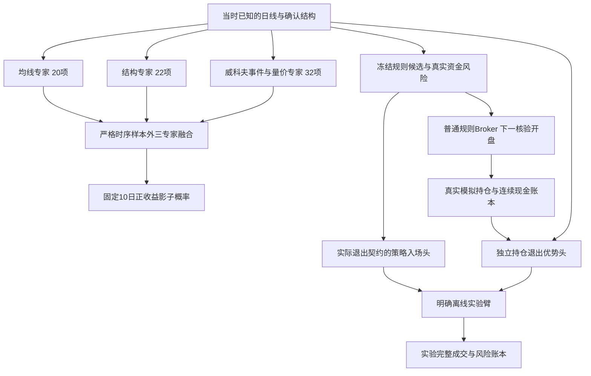

# 威科夫三专家与实际策略目标约定

日期：2026-10-09。均线、结构与威科夫量价已接入同一研究链路。新概率保留影子资格；工程验收与开发窗口账本不构成正式交易或盈利认证。实施范围为原计划 P0 至 P4，树模型是可选对照，因果 TCN 的 P5 仍取决于独立序列增量证据。

## 数据与事件时间

冻结均线源覆盖5,572只股票和11,276,786条未复权日线，截至2026-10-08。量价32项投影另存新运行，不改旧均线20项、结构22项、固定10日标签、旧模型或日历。模型及实际成交目标仅支持3,197只沪深主板股票；其他板块展示可解释结构及排除原因。

威科夫区间独立由截至当时的原始量价构造。Spring 与 SOS 保持待后续测试；Test 和 LPS 才是需求候选。Upthrust、SOW 和 LPSY 表示供应证据。事件分别记录 `anchor_at`、`observed_at`、`available_at`；突破使用此前已经形成的边界，图表标记落在首次确认日。未闭合周月不绘制日线事件，需求和供应规则分数不称为盈利概率。

质量检查保留零成交、量额单位疑点、疑似公司行动断点及日期缺口。因果排除只使用当时已知输入。缺历史ST、退市证券和具备生效时间的公司行动身份，仍阻断正式资格。质量过滤没有修复现金分红、股份调整或现有未复权持仓标签；这些修改必须另立数据及目标版本，并在同一口径重训三专家及独立策略头。

## 三种独立概率目标

|目标|决策输入及完整结果|普通工作台用途|
|---|---|---|
|固定10日入场|t收盘已知的20项均线、22项结构和32项量价；t+1核验开盘买入、t+11核验开盘卖出，费用后正收益|三个独立专家与三专家融合的影子观察|
|实际持仓退出|Broker实际现金、剩余份额、含费成本、持仓日数、冻结止损及已知量价；比较下一核验开盘卖出与冻结规则续持，两条卖出路径均完整闭合|真实模拟持仓的独立退出影子，理论分析不生成概率|
|实际策略入场|全部满足可决策条件的冻结候选，以及当时真实资金与风险；逐候选克隆账户，按冻结退出策略完整回放费用后往返|空仓候选的独立策略影子，使用对应资金、候选、退出契约|

固定10日概率不能代替提前退出策略的获利概率；退出优势也不是 `1-p_buy`。拒单、未成熟和未平仓均保留单独状态，不当作亏损标签，不强制期末虚拟成交。策略入场头绑定每股100,000元原始资本及资金特征；其他资本下的最低佣金效应改变目标，普通回放不提供该头的可用概率。

均线与结构使用冻结源模型及已有严格时序样本外概率，量价专家和三概率融合器使用正则线性模型。每个外层检查点清除标签跨界，训练段独立拟合预处理，时序验证段校准。阈值按验证段的固定候选真实Broker账本选择，并要求最低覆盖和完整往返；无交易或不可选择时保留空阈值，不以零交易伪造改进。

## 候选与连续账户

新 C3 至 C7 臂先冻结规则原始候选，再根据模型或量价证据否决该候选。否决不会改变后续理论Position路径，也不会自动创造稍后买点。旧六臂账本仍为原来源的诊断参考，其旧动态ML路径可能改变后续候选，不能直接称作受控增量。

14个主臂比较规则、旧均线或结构、旧双专家、量价规则、量价ML、三专家、独立退出、实际策略入场及扩展候选。三个辅助对照分别固定双专家候选，并在相同量价输入资格下比较双专家过滤与纯规则，从而区分输入排除、候选路径和新概率的影响。策略样本来自全部可决策候选的资金克隆，包含原模型未选择的候选。

退出状态包括规则和严格前向行为策略产生的真实持仓。实际策略标签的续持路由只能用当时已经可用的头，不允许最终头回填早期持仓。各行为策略身份和状态覆盖保留，同一经济状态出现在不同冻结行为路径时不称为独立新增样本。

普通回放不应用新模型入场或退出，原生退出、实际止损与强制退出优先。模型切换沿时间顺序进行，不重置仓位、现金或账本。无新量价模型或输入时，仅在来源、固定10日目标和核验日历一致的情况下显示双专家影子回退；缺失概率保留为空，不用零值替代。固定未来检查点被拒绝，生产时点同时检查实际训练完成时间。

## 证据与正式资格

四个已观察历史季度用于开发诊断。比较同时报告完整往返胜率、净收益、盈亏比、每笔期望、回撤、尾部损失、持仓时长、资金占用与未平仓；胜率本身不能认证盈利。收益依赖按冻结160与240交易日区块处理，季度样本不足时配对置信区间保持不可用，不缩短区块或用股票随机抽样制造通过。

费用压力使用冻结模型、阈值和候选，实际Broker重放1.5与2倍佣金、最低佣金、印花税和滑点。压力交易结果因真实手数、现金、拒单及止损而改变；策略概率仍绑定原始费用目标，压力结果只作为固定政策敏感性分析，不重训或重新择参。

最终冻结文件另存实际完成时间、源代码与配置、模型文件、源输入、审计及运行证据的SHA。新增独立窗口从最终冻结之后第一个经核验交易日开始；尚无核验未来日期时起点为空。既有双专家窗口、历史报告和权重保持不变。新验证达到成熟目标及足够独立样本，并补齐关键历史身份后，才可以重新判断正式资格。

执行结果、完整窗口表、真实设备计数与可复现入口追加在同日的威科夫执行记录。所有报告和个人关注、手动持仓相互独立。
